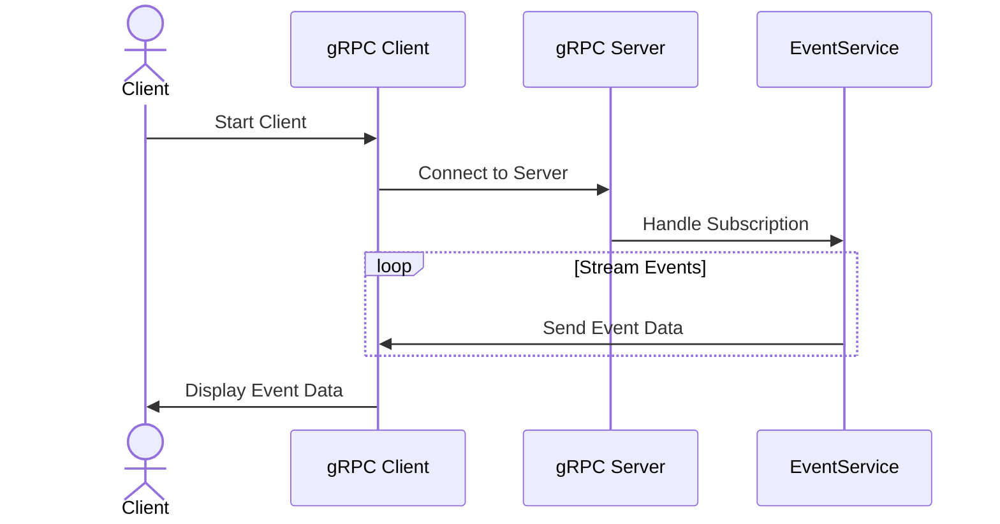
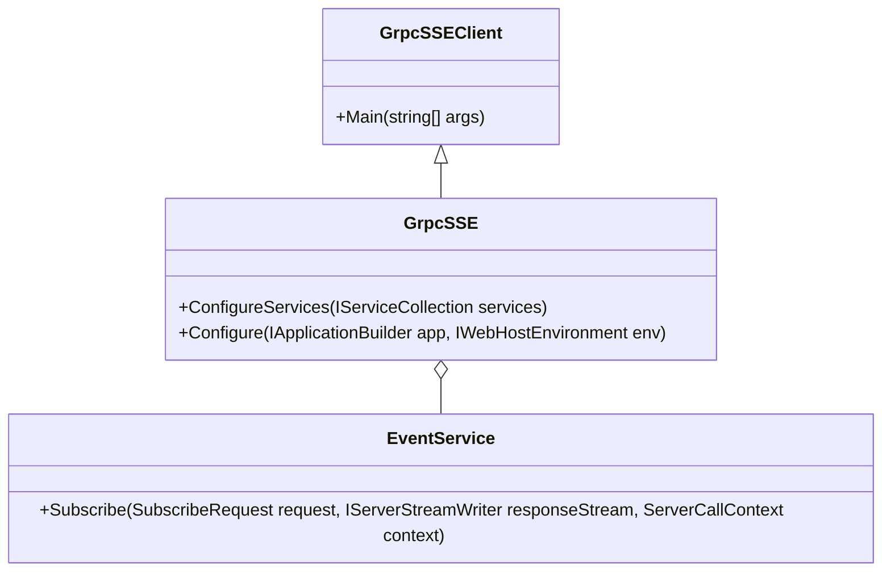

# PoC gRPC using .NET

This repository demonstrates a Proof of Concept (PoC) implementation of gRPC using .NET, focusing on server-sent events. It includes both the server and client implementations, illustrating how to build and consume gRPC services for real-time event streaming.

---

## Features

- **gRPC Server:** Handles client subscriptions and streams real-time events.
- **gRPC Client:** Connects to the server and processes received events.
- **Server-Sent Events:** Implements a streaming mechanism using gRPC for efficient real-time data delivery.

---

## Project Structure

- **GrpcSSE**: Contains the server-side implementation.
- **GrpcSSEClient**: Contains the client-side implementation.
- **proto**: Contains the `messages.proto` file defining the gRPC service contracts.

--

## Architecture

### Sequence Diagram: gRPC Server-Sent Events



### Class Diagram: gRPC Server and Client



---

## Prerequisites

- [.NET SDK](https://dotnet.microsoft.com/download)
- [gRPC tools](https://grpc.io/docs/languages/csharp/quickstart/)
- gRPC NuGet packages:
  - `Grpc.AspNetCore`
  - `Grpc.Tools`

---

## Setup and Run

1. **Clone the repository:**

   ```bash
   git clone https://github.com/your-username/grpc-poc-dotnet.git
   cd grpc-poc-dotnet
   ```

2. **Restore dependencies:**

   ```bash
   dotnet restore
   ```

3. **Run the server:**

   ```bash
   cd GrpcServer
   dotnet run
   ```

4. **Run the client:**

   ```bash
   cd GrpcClient
   dotnet run
   ```

---

## Useful Links

- [Server-Sent Events with gRPC in .NET by Gabriele Tronchin](https://medium.com/@gabrieletronchin/c-net-server-sent-events-with-grpc-2fc6f197d955)

---

## License

This project is licensed under the MIT License. See the `LICENSE` file for details.
